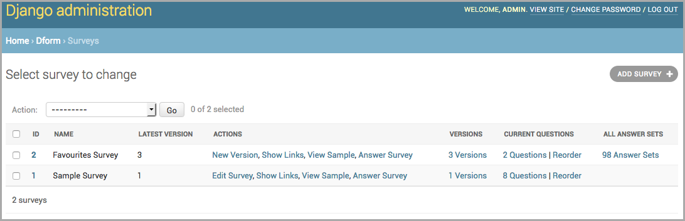
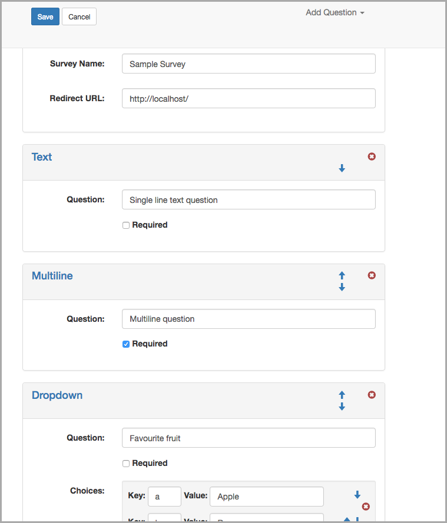

Concepts
********

DForm is a survey creation and management tool.  It allows you to create
surveys using Bootstrap 3 style forms, manage multiple versions of a survey
and edit your answers.

Everything in DForm revolves around a :class:`.Survey` object.  Each survey
can have multiple versions associated, allowing you to edit your questions but
still do queries across the edited versions.  When a :class:`.Survey` object
is created, a corresponding :class:`.SurveyVersion` object is automatically
generated.  

Each :class:`.SurveyVersion` can have :class:`.Question` objects associated
with it.  Questions are actually stored as two different objects in the
database in order to allow for changing their order between versions.

Answers to questions are grouped together using the :class:`.AnswerGroup`
object.  These objects have a ``group_data`` property which is a
:class:`GenericForeignKey` so if you warp the default views you can associate
data in your system with the :class:`.AnswerGroup` -- this can be useful if
you want to track the Django :class:`User` of the submitter or other metadata.

:class:`Answer` objects have multiple storage types so that answer data can
be stored natively in the database.  This allows you to write reports, do
queries, or run aggregates using other tools.  This makes storage less than
efficient, as each answer is going to have multiple empty fields.

GUI
***

DForm has a simple Survey Editor to manage a survey and its questions, but
otherwise uses the django admin.  On the
django admin change-list screen for the :class:`.Survey`, the "Add Survey"
button has been over-loaded to point to the Survey Editor, all other "Add
Model" buttons have been removed.  Use either the Survey Editor or the links
provided on the change-list screen to manipulate the various model objects.

.. warning::
    The django admin makes it pretty easy to change the change-list screen,
    but the app-index screen is a fragile mess.  The "Add +" links on the
    app-index screen have not been removed and will point at the original
    django admin create screens for those models.  This is far more
    complicated than using the Survey Editor.  

**Django Change List Screen**

**Survey Editor**

Configuration
*************

URL Hooks and Management
========================

DForm splits its URLs into two files: one for admin and one for public facing
views.  The public facing views have no security mechanisms in place and so
have been put into their own file in case you want to role your own.

The public facing URLs do have tokens associated with them to prevent easy
guessing of other survey URLs.

There are two ways to create better security for the public facing URLs: use
the `Permission Hook`_ mechanism or `Role Your Own Views`_.

Permission Hook
---------------

Out-of-the-box, DForm comes with two sets of URL files: one for the admin URLs
and one for the public URLs.  The admin URLs are for creating and editing
survey and require the user to be a member of staff of admin.

As you may not want just anyone submitting or modifying survey answers, the
public facing URLs come with a permission hook.  This hook allows you to
define a function that is called for each call to the submission views.

In your ``settings.py`` file:

.. code-block:: python

    DFORM_PERMISSION_HOOK = 'special.my_hook'

The ``DFORM_PERMISSION_HOOK`` value is set to the fully dot-qualified name of
a function in a module.  The function will be called with the name of the view
being checked as well as all of the arguments for the view.

An example hook:

.. code-block:: python

    # special.py

    import logging
    from django.http import Http404

    logger = logging.getLogger(__name__)

    def my_hook(name, *args):
        request = args[0]
        if name == 'survey_with_answers':
            logger.debug('survey_with_answers: version=%s answer_group=%s',
                args[1], args[2])
            raise Http404
        elif name == 'sample_survey':
            logger.debug('sample_survey: version=%s', args[1])
        elif name == 'survey':
            logger.debug('survey: version=%s', args[1])

The hook defined above will allow anyone to submit a survey or view a sample,
but if they attempt to call the view that changes answers a 404 is raised.
This is overly simplistic as it would stop even the admin from changing the
values.

Alternatively, you could write your own views that wrap calls to the survey
submission views.  If you do this and define the URLs with the appropriate
names the admin links should still work.  See :doc:`views` for the URL name
references for each of the views.

Role your Own Views
-------------------

The DForm admin pages include links to the various actions you can perform on
a survey.  As it is possible for you to create your own public facing survey
views (for better security management), it is best if you use the reverse
look-up names that the admin expects:

dform-sample-survey
    View to display a sample of the survey.  Doesn't not allow submitting
    answers and the ``Submit`` button does nothing

dform-survey
    View to display (GET) and submit (POST) a survey 

dform-survey-with-answers
    View to display (GET) and submit (POST) a survey that has answers already

dform-embedded-survey or dform-embedded-survey-with-answers
    Variations on the survey display and posting that use ``pym.js`` to handle
    responsive layouts when embedding the form in an iframe.

Wrapping Survey Submission Views
================================

The built-in survey submission views set the HTML form action attribute to
themselves.  To change where the forms submit to add settings:

.. code-block:: python

    DFORM_SURVEY_SUBMIT = '/my_survey/{{survey_version.id}}/'
    DFORM_SURVEY_WITH_ANSWERS_SUBMIT = \
        '/my_survey_with_answers/{{survey_version.id}}/{{answer_group.id}}/'

These settings are processed through the Django template mechanism with a
context of the :class:`.SurveyVersion` and 
:class:`.AnswerGroup` as appropriate.

Survey Submission Success
=========================

The buit-in survey submission views support several different ways of
determining where to redirect to after a successful submission.  The first is
through settings:

.. code-block:: python

    DFORM_SUCCESS_REDIRECT = '/after_submit/'

The second mechanism is the ``success_redirect`` field on the :class:`.Survey`
object.  If this value is set it overrides any settings configuration.
Similarly, the ``success_redirect`` field on the :class`SurveyVersion`
overrides the field of the same name on the parent :class:`.Survey` and value
for settings.

If none of these are set for a given survey version an :class:`.AttributeError`
is raised.

Using DForm in IFRAMEs
**********************

DForm includes the excellent library ``pym.js``
(http://blog.apps.npr.org/pym.js/) to deal with the issues caused
by responsive content in IFRAMEs.  There are two URLs for each of the survey
and survey-with-answers calls that add the extra Javascript necessary to get
responsive behaviour inside an IFRAME tag.

Inside the admin pages for each survey, survey version and answer group you
will find a "Show Links" action.  This will show a page that gives examples of
how to include the URLs for the selected survey with and without embedding.
